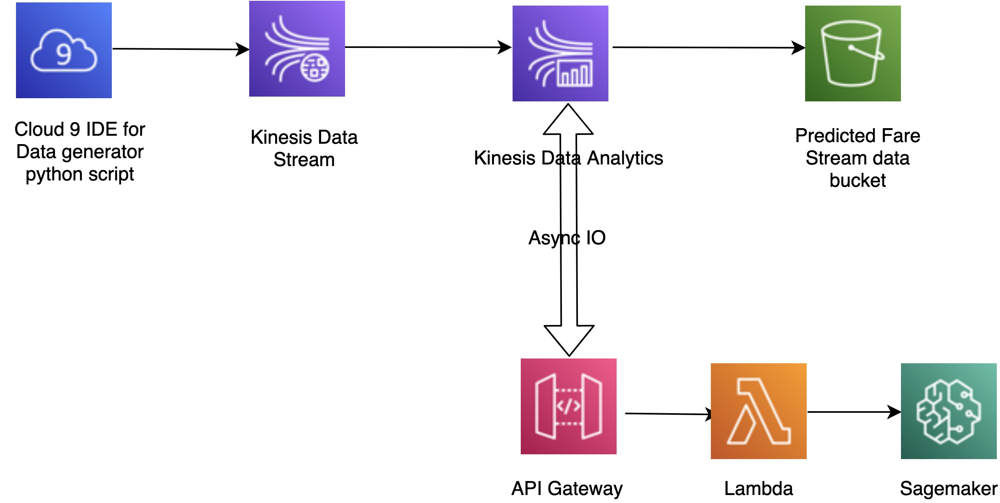

This extension is for Lab 7 of the AWS SageMaker Immersion Day Training, which focuses on real-time ML inference on streaming data. The original lab covers the following workflow:



In the original lab, predictions based on the Kinesis Stream are output to an S3 bucket.

This repository modifies the existing solution by replacing the S3 bucket output with a kinesis stream output. This enables you to maintain an event-driven architecture.

Prerequisites:

* Having a properly running setup according to the Lab7 instructions
* Adding IAM policies of the Kinesis Service for AWS CloudWatch
* Updating the Streaming App with the extended Flink App ```Flink-Async-IO-1.0.jar``` from the target folder of the repo (or compile it yourself for security reasons)
* Creating a new Kinesis Data Stream for the output
* Ensuring you have the following App properties in place with the group id ```FlinkApplicationProperties```:
    * ```wait_mode```
    * ```region```
    * ```input_stream_name```
    * ```kinesis_output_stream_name```
    * ```waitOperatorParallelism```
    * ```timeout```
    * ```capacity```
    * ```post_request_url```
